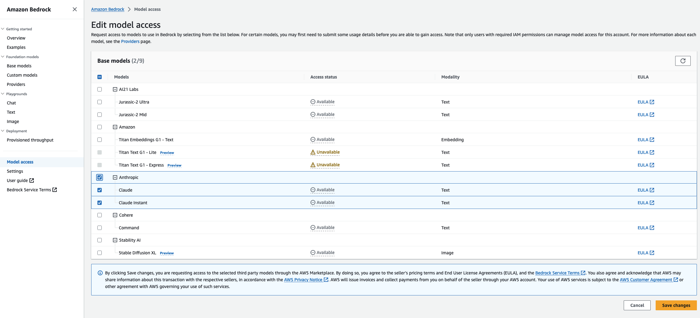

# Amazon Chime SDK Call Analytics Real-Time Summarizer

## What It Is

In this demo we see how to create a near real-time call summarizer using the Amazon Chime SDK call analytics and a Cohere Large Language Model (LLM). In order to provide results as quickly as possible, this demo will use the real-time [Amazon Transcribe](https://aws.amazon.com/transcribe/) feature of [Amazon Chime SDK call analytics](https://docs.aws.amazon.com/chime-sdk/latest/dg/call-analytics.html). This will allow us to produce a transcript of the call almost immediately after the call is completed. With this transcription, we can invoke an LLM via [Amazon Bedrock](https://aws.amazon.com/bedrock/). In this example, the default prompt used is `What is the customer calling about and what are the next steps?` so that we can generate a summary of the call that can be used almost immediately by an agent as part of their post-call wrap up.

## Technical Overview


### Capturing Transcripts

In order to produce a summary very quickly, we must capture real-time transcriptions using Amazon Transcribe through Amazon Chime SDK call analytics. To do this, we will take the output of the Amazon Chime SDK call analytics media insight pipeline and write the transcripts to an [Amazon DynamoDB](https://docs.aws.amazon.com/amazondynamodb/latest/developerguide/Introduction.html) table. We will do this by processing the output of the [Amazon Kinesis Data Stream](https://docs.aws.amazon.com/streams/latest/dev/introduction.html) with an [AWS Lambda](https://docs.aws.amazon.com/lambda/latest/dg/welcome.html) function.

```typescript
try {
  const putCommand = new PutItemCommand({
    TableName: process.env.TRANSCRIBE_TABLE,
    Item: {
      transactionId: { S: metadata.transactionId },
      timestamp: { N: epochTime },
      channelId: { S: postData.TranscriptEvent.ChannelId },
      startTime: { N: postData.TranscriptEvent.StartTime.toString() },
      endTime: { N: postData.TranscriptEvent.EndTime.toString() },
      transcript: {
        S: postData.TranscriptEvent.Alternatives[0].Transcript,
      },
    },
  });
  await dynamoDBClient.send(putCommand);
} catch (error) {
  console.error('Failed to insert record into DynamoDB:', error);
}
```

At the same time, we will write this information to a [WebSocket API](https://docs.aws.amazon.com/apigateway/latest/developerguide/apigateway-websocket-api.html) using [Amazon API Gateway](https://docs.aws.amazon.com/apigateway/latest/developerguide/welcome.html). This information can be delivered in near real-time to the client. This will continue as long as the call lasts.

### Post-Call Processing

Once the call has completed, a notification event will be sent to [Amazon EventBridge](https://docs.aws.amazon.com/eventbridge/latest/userguide/eb-what-is.html). When we receive that event, we will:

- Query the DynamoDB table
- Parse the results
- Create a prompt
- Send the prompt to our LLM
- Send the response to our WebSocket API

```python
transaction_id = event['detail']['transactionId']

params = {
    'TableName': TRANSCRIBE_TABLE,
    'FilterExpression': '#tid = :tid',
    'ExpressionAttributeNames': {
        '#tid': 'transactionId',
    },
    'ExpressionAttributeValues': {
        ':tid': {'S': transaction_id},
    },
}

try:
    response = dynamodb.scan(**params)
except ClientError as error:
    logger.error('%s DynamoDB scan failed: %s ', LOG_PREFIX, error)
    raise error

items = [
    {k: deserializer.deserialize(v) for k, v in item.items()}
    for item in response.get('Items', [])
]

items.sort(key=lambda item: item.get('timestamp'))

conversation = ''
for item in items:
    speaker = 'Agent' if item.get('channelId') == 'ch_0' else 'Caller'
    conversation += f'{speaker}: {item.get("transcript")}\n'

logger.info('%s Conversation: %s', LOG_PREFIX, conversation)
prompt = create_prompt(conversation)
logger.info('%s Prompt: %s', LOG_PREFIX, prompt)
bedrock_response = get_response(prompt)
write_to_websocket(bedrock_response)
```

Because we have been capturing the transcription results as they are created, the process for reading, parsing, and making the Bedrock request can be done very quickly. This allows us to create a summarization of the call in a matter of seconds, rather than minutes.

## Accessing Bedrock

In order to use this demo, you will need [access to the Anthropic models](https://docs.aws.amazon.com/bedrock/latest/userguide/model-access.html) in Bedrock.



## Invoking Bedrock Model

For this demo, we are using the `anthropic.claude-instant-v1` model. This requires us to [build a prompt](https://docs.anthropic.com/claude/docs/introduction-to-prompt-design#human--assistant-formatting) that Claude will understand.

```python
def create_prompt(conversation):
    return f'\n\n \
    Human: This is a conversation between two people, a caller and an agent.\n\n \
    {conversation}\n\n \
    {SUMMARY_QUESTION}\n\n \
    Assistant:'


def get_response(prompt):

    body = json.dumps({
        "prompt": prompt,
        "temperature": 0,
        "max_tokens_to_sample": 4000,
    })

    try:
        bedrock_response = bedrock_runtime.invoke_model(
            body=body,
            modelId=MODEL_ID
        )
        logger.info("%s Bedrock Response: %s", LOG_PREFIX, bedrock_response)
        response_body = json.loads(bedrock_response.get("body").read())
        return response_body.get("completion")

    except ClientError as error:

        if error.response['Error']['Code'] == 'AccessDeniedException':
            print(f"\x1b[41m{error.response['Error']['Message']}\
                    \nTo troubleshoot this issue please refer to the following resources.\
                    \nhttps://docs.aws.amazon.com/IAM/latest/UserGuide/troubleshoot_access-denied.html\
                    \nhttps://docs.aws.amazon.com/bedrock/latest/userguide/security-iam.html\x1b[0m\n")

        else:
            raise error
```

We pass this prompt to Bedrock and pass the response to the WebSocket API.

## Testing

To test this demo, navigate to the Cloudfront Distribution webpage and call the included phone number. When the call is answered, a WAV file will be played simulating the responses from a sample agent.

## Results

Once the call has been completed, and the summarization produced, the result will be delivered to the included client.


## Deploy

### Prerequisites

- yarn - https://yarnpkg.com/getting-started/install
- Docker desktop - https://www.docker.com/products/docker-desktop/
- AWS account
- Basic understanding of telephony

### Deploy

To deploy this demo:

```
yarn launch
```

### Cleanup

```
yarn cdk destroy
```
