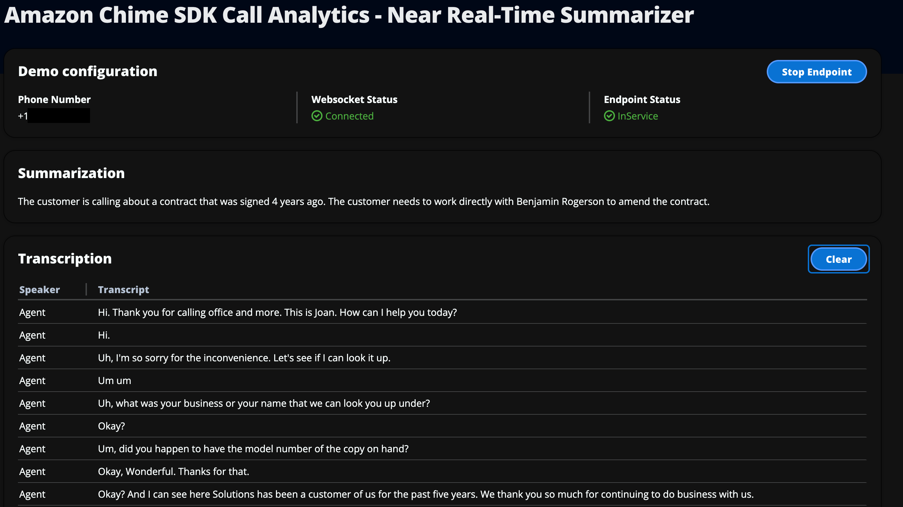

# Amazon Chime SDK Call Analytics Real-Time Summarizer

## What It Is

In this demo we see how to create a near real-time call summarizer using the Amazon Chime SDK call analytics and a Cohere Large Language Model (LLM). In order to provide results as quickly as possible, this demo will use the real-time [Amazon Transcribe](https://aws.amazon.com/transcribe/) feature of [Amazon Chime SDK call analytics](https://docs.aws.amazon.com/chime-sdk/latest/dg/call-analytics.html). This will allow us to produce a transcript of the call almost immediately after the call is completed. With this transcription, we can invoke an LLM via an [Amazon SageMaker endpoint](https://docs.aws.amazon.com/sagemaker/latest/dg/realtime-endpoints-deployment.html). With this transcription and this endpoint, we can prompt the LLM to produce a response. In this example, the default prompt used is `What is the customer calling about and what are the next steps?` so that we can generate a summary of the call that can be used almost immediately by an agent as part of their post-call wrap up.

## Technical Overview


### Capturing Transcripts

In order to produce a summary very quickly, we must capture real-time transcriptions using Amazon Transcribe through Amazon Chime SDK call analytics. To do this, we will take the output of the Amazon Chime SDK call analytics media insight pipeline and write the transcripts to an [Amazon DynamoDB](https://docs.aws.amazon.com/amazondynamodb/latest/developerguide/Introduction.html) table. We will do this by processing the output of the [Amazon Kinesis Data Stream](https://docs.aws.amazon.com/streams/latest/dev/introduction.html) with an [AWS Lambda](https://docs.aws.amazon.com/lambda/latest/dg/welcome.html) function.

```typescript
try {
  const putCommand = new PutItemCommand({
    TableName: process.env.TRANSCRIBE_TABLE,
    Item: {
      transactionId: { S: metadata.transactionId },
      timestamp: { N: epochTime },
      channelId: { S: postData.TranscriptEvent.ChannelId },
      startTime: { N: postData.TranscriptEvent.StartTime.toString() },
      endTime: { N: postData.TranscriptEvent.EndTime.toString() },
      transcript: {
        S: postData.TranscriptEvent.Alternatives[0].Transcript,
      },
    },
  });
  await dynamoDBClient.send(putCommand);
} catch (error) {
  console.error('Failed to insert record into DynamoDB:', error);
}
```

At the same time, we will write this information to a [WebSocket API](https://docs.aws.amazon.com/apigateway/latest/developerguide/apigateway-websocket-api.html) using [Amazon API Gateway](https://docs.aws.amazon.com/apigateway/latest/developerguide/welcome.html). This information can be delivered in near real-time to the client. This will continue as long as the call lasts.

### Post-Call Processing

Once the call has completed, a notification event will be sent to [Amazon EventBridge](https://docs.aws.amazon.com/eventbridge/latest/userguide/eb-what-is.html). When we receive that event, we will:

- Query the DynamoDB table
- Parse the results
- Create a prompt
- Send the prompt to our LLM
- Send the response to our WebSocket API

```python
    if event_type == 'chime:MediaInsightsInProgress':
        logger.info('Media Insights In Progress')
    elif event_type == 'chime:MediaInsightsStopped':
        logger.info('Media Insights Stopped')

        transaction_id = event['detail']['transactionId']

        params = {
            'TableName': os.getenv('TRANSCRIBE_TABLE'),
            'FilterExpression': '#tid = :tid',
            'ExpressionAttributeNames': {
                '#tid': 'transactionId',
            },
            'ExpressionAttributeValues': {
                ':tid': {'S': transaction_id},
            },
        }

        try:
            response = dynamodb.scan(**params)
        except ClientError as error:
            logger.error('%s DynamoDB scan failed: %s ', LOG_PREFIX, error)
            raise error

        items = [
            {k: deserializer.deserialize(v) for k, v in item.items()}
            for item in response.get('Items', [])
        ]

        items.sort(key=lambda item: item.get('timestamp'))

        conversation = ''
        for item in items:
            speaker = 'Agent' if item.get('channelId') == 'ch_0' else 'Caller'
            conversation += f'{speaker}: {item.get("transcript")}\n'

        logger.info('%s Conversation: %s', LOG_PREFIX, conversation)
        prompt = create_prompt(conversation)
        logger.info('%s Prompt: %s', LOG_PREFIX, prompt)
        cohere_response = get_response(prompt)

        logger.info('%s Cohere Response: %s', LOG_PREFIX, cohere_response)

        write_to_websocket(cohere_response)

    return {
        'statusCode': 200,
    }
```

Because we have been capturing the transcription results as they are created, the process for reading, parsing, and making the SageMaker request can be done very quickly. This allows us to create a summarization of the call in a matter of seconds, rather than minutes.

## Testing

To test this demo, navigate to the Cloudfront Distribution webpage. 

If 'Endpoint Status' shows as 'Endpoint disabled', click on 'Start Endpoint' to enable the SageMaker endpoint (This could take few mins to enable). Once 'Endpoint Status' shows as 'InService', you are ready to test. 

Call the included phone number. When the call is answered, a WAV file will be played simulating the responses from a sample agent.

## Results

Once the call has been completed, and the summarization produced, the result will be delivered to the included client.



## Deploy

### Prerequisites

- yarn - https://yarnpkg.com/getting-started/install
- Docker desktop - https://www.docker.com/products/docker-desktop/
- AWS account
- Basic understanding of telephony
- [Request access to Amazon SageMaker - Foundation models](https://docs.aws.amazon.com/sagemaker/latest/dg/jumpstart-foundation-models-use.html) (this could take few days) 

### Deploy

To deploy this demo:

```
yarn launch
```

Attention: This deployment includes Amazon SageMaker endpoint which you incur additional charges when you start the SageMaker endpoint. We recommend you to stop the Amazon SageMaker endpoint by clicking on the 'Stop Endpoint' button once finished with the experiment to avoid unexpected charges. See [Amazon SageMaker pricing](https://aws.amazon.com/sagemaker/pricing/) for relevant costs.

### Cleanup

```
yarn cdk destroy
```
